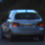
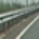
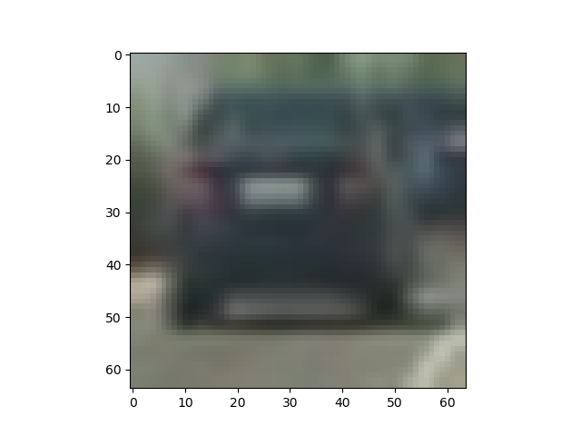
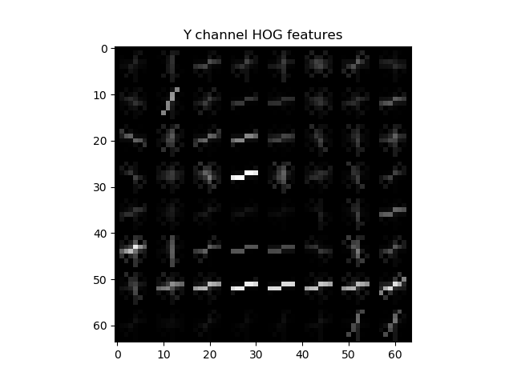
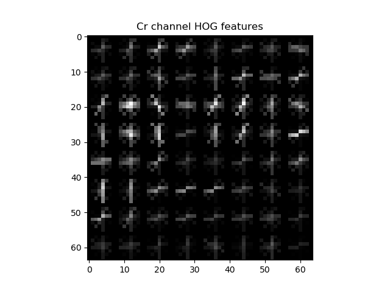
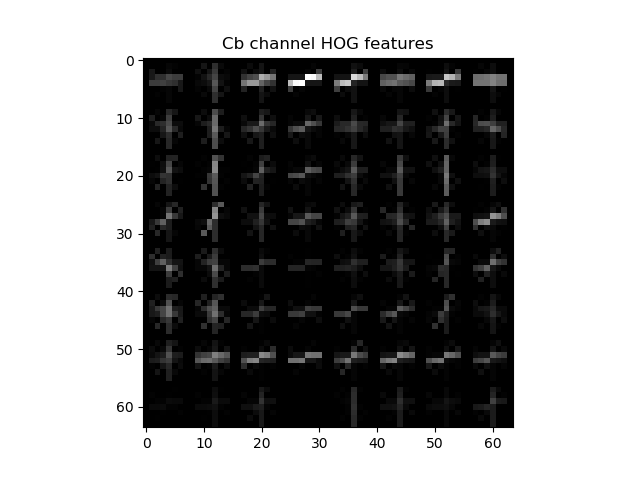
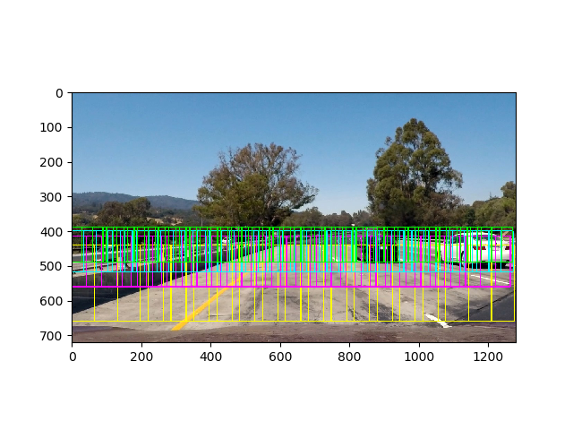
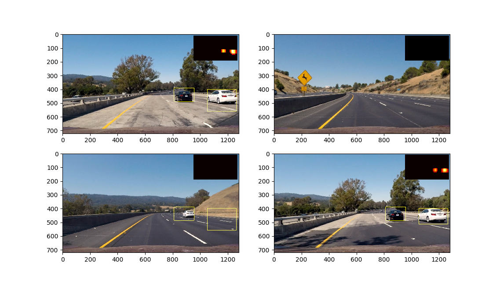

**Vehicle Detection Project**

The goals / steps of this project are the following:

* Perform a Histogram of Oriented Gradients (HOG) feature extraction on a labeled training set of images and train a classifier Linear SVM classifier
* Optionally, you can also apply a color transform and append binned color features, as well as histograms of color, to your HOG feature vector. 
* Note: for those first two steps don't forget to normalize your features and randomize a selection for training and testing.
* Implement a sliding-window technique and use your trained classifier to search for vehicles in images.
* Run your pipeline on a video stream (start with the test_video.mp4 and later implement on full project_video.mp4) and create a heat map of recurring detections frame by frame to reject outliers and follow detected vehicles.
* Estimate a bounding box for vehicles detected.

## [Rubric](https://review.udacity.com/#!/rubrics/513/view) Points
### Here I will consider the rubric points individually and describe how I addressed each point in my implementation.  

---

### Histogram of Oriented Gradients (HOG)

#### 1. Extracting HOG features from the training images.

HOG features extraction (along with spatial and histogram features) is implemented in `FeatureExtractor` class. To use it we can simply set all necessary parameters in it's constructor and then use it for all images.

First of all, training data directory is scanned, lists of vehicles and non-vehicles are retrieved and stored in dictionary. After that, each image is processed and it's features are extracted using `FeatureExctractor`.

Vehicle and non-vehicle images example:

Here is an example using the `YCrCb` color space and HOG parameters of `orientations=9`, `pixels_per_cell=(8, 8)` and `cells_per_block=(2, 2)`:

#### 2. Explain how you settled on your final choice of HOG parameters.

I settled on my final choice of HOG parameters empirically, checking the test accuracy of trained classifier.

#### 3. Describe how (and identify where in your code) you trained a classifier using your selected HOG features (and color features if you used them).

I used linear SVM, which was trained using retrieved features. Training is implemented in `train()` function of `VehicleDetector` class, feature scaling is done in that class too. After training classiefier and scaler can be dumped into files in order to use them later.

### Sliding Window Search

#### 1. Describe how (and identify where in your code) you implemented a sliding window search.  How did you decide what scales to search and how much to overlap windows?

Since we are trying to find vehicles in 3D world, we shoud remember that vehicles can have different sizes and may be on different distance from us. I used four types of windows with different size and Y position on the image. Scales and overlaps were choosen empirically, trying to decrease the amount of detected garbage and to increase the accuracy of retrieved bounding boxes.

#### 2. Show some examples of test images to demonstrate how your pipeline is working.  What did you do to optimize the performance of your classifier?

In final implementation I searched on four scales using YCrCb 3-channel HOG features plus spatially binned color and histograms of color in the feature vector, which provided a nice result. Here are some example images:

---

### Video Implementation

#### 1. Provide a link to your final video output.  Your pipeline should perform reasonably well on the entire project video (somewhat wobbly or unstable bounding boxes are ok as long as you are identifying the vehicles most of the time with minimal false positives.)
Here's a [link to my video result](https://github.com/grygoryant/CarND-Vehicle-Detection/blob/master/project_video_annotated.mp4)

#### 2. Describe how (and identify where in your code) you implemented some kind of filter for false positives and some method for combining overlapping bounding boxes.

For each frame I recorded the positions of positive detections. After that, using those positions I created a heatmap and then thresholded that map to remove false positive detections. In order to smooth the output and to remove false positives, the latest 20 frames' detections are stored in deque, and then averaged using all detections in deque (`get_avg_detections()` function). The result of this approach can be checked in the project video.

---

### Discussion

#### 1. Briefly discuss any problems / issues you faced in your implementation of this project.  Where will your pipeline likely fail?  What could you do to make it more robust?

The most important issue I faced in this project was the image pixel values scaling issue: for training I used `.png` images which values are in [0;1]. But for processing I had `.jpeg` images, which values are in [0;255].
My pipeline has few scanning windows and this gives not so accurate result and sometimes it gives false positive detections in scanning windows intersection regions. I guess it is possible to improve the scanning windows approach in order to decrease the number of false positives.

